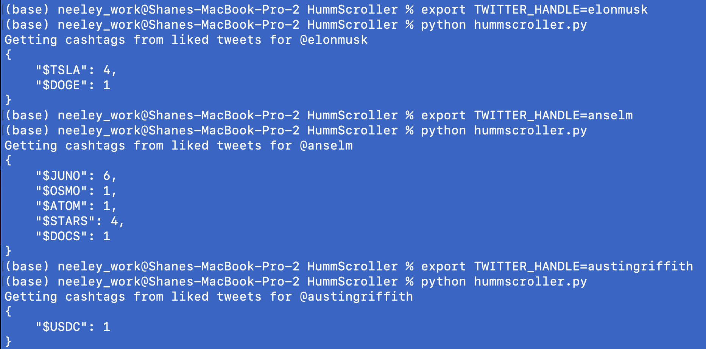

---

## ⚡ What is HummScroller?

Do you feel like you've curated a good Crypto Twitter? Put your money where your likes are! With HummingScroller, you sit and zone-out on Twitter, liking crypto posts you agree with, as you already do. HummScroller watches your Twitter account and buys the tokens (present in `$cashtags`) in the Tweets that you hit "like" on!

After 24 hours, HummScroller then sells that token back into stablecoins, and pulls your new recent likes to build a new portfolio. New portfolios are built every day based on the changing sentiment towards coins that you decide by liking them.

## 📈 How to Use It?

Install it Via Telegram: TBD

Telegram Bot Command: `/hummscroller @my_handle` -- call the bot and enter your Twitter handle.

This registers a paper "mock" trading account in a Hummingbot instance.

Now just keep zoning out on Crypto Twitter! It's scanning tweets that you like.

# ✨ How it Works

Currently only working on paper trading with a Binance connector through Hummingbot.

Your most recent 100 Tweets will be scanned for any cashtags, which will then build a dataset about what you've liked recently.

# 📟 Backend

Set Twitter [API Keys](https://developer.twitter.com/en/portal/projects-and-apps):

`export TWITTER_HANDLE=elonmusk` -- you can monitor other people's Twitter likes too!

`export TWITTER_API_BEARER=AAAAA...` -- need a Twitter Developer account to use V2 API.

Twitter Script: `humscroller.py` -- produces a file `recent_tweet_likes.json`

---

Hummingbot Script: `humminggram.py` -- Performs daily market order trades based on the data.

**Got to this point where it was buying BTC-USDT, but wasn't updating the paper balance on Hummingbot**

---

Telegram Bot: TBD -- commands like `/humscroller_init @handle`, `/humscroller_stats`, `humscroller_leaderboard`

---

Hosting & Deployment: TBD

# 📡 Future Plans

- A Telegram Group "Investment DAO" Game where you compete with members to have the more profitable Crypto Twitter.
- **Countertrading**. Not your twitter handle, because you're smart, but someone who you think is an idiot. Everything they like, you sell.
- Use real money, not paper trading.
- Scan not just likes, but retweets also.
- AI sentiment classification to break tweets into the bullish and bearish parts.
- Get audio from `Spaces` you were in, how long you stayed (enjoyed it) and correlate that to tokens.
